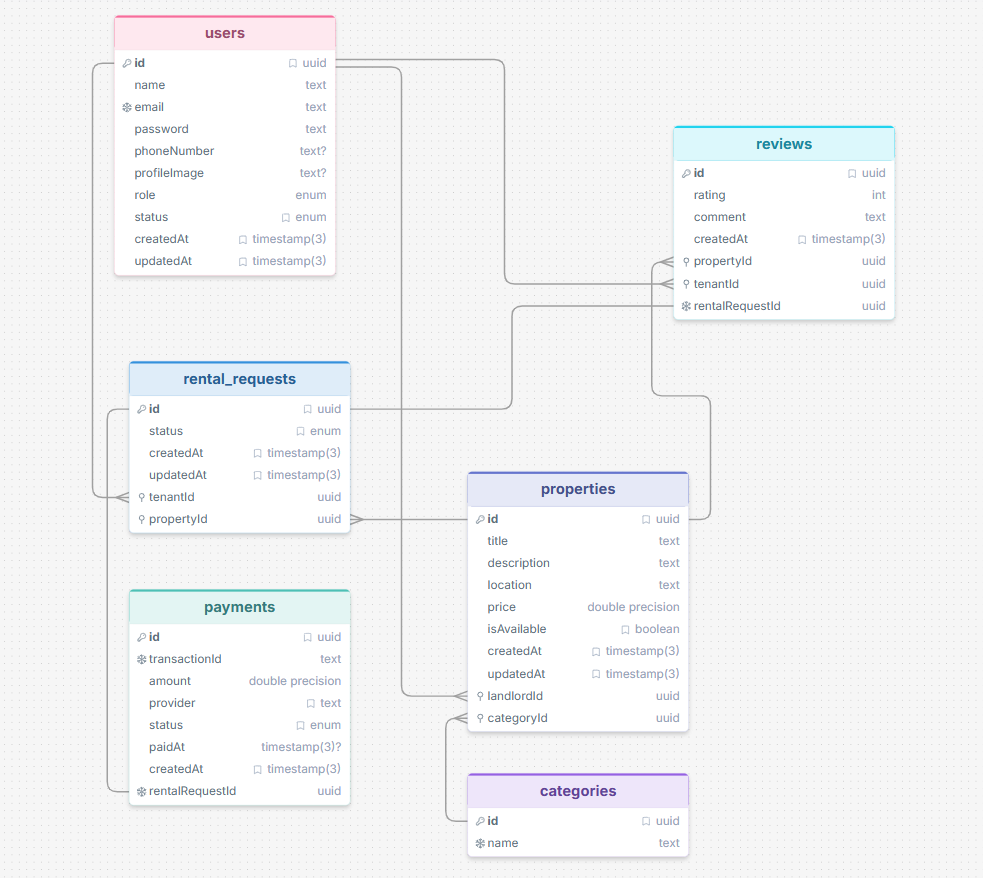

# RentNest — Rental Property Marketplace Backend API

A backend API for a rental property marketplace where **Tenants** can browse and rent properties, **Landlords** can list and manage properties, and **Admins** oversee the platform. Built with Node.js, Express, TypeScript, PostgreSQL (Prisma), JWT authentication, and Stripe for payments.
---

## 🔑 Key Information & Live Links

*   **Live API URL:** [https://prisma-ass-4.vercel.app](https://prisma-ass-4.vercel.app)
*   **API Documentation:** [https://documenter.getpostman.com/view/47061060/2sBY4QtLGQ](https://documenter.getpostman.com/view/47061060/2sBY4QtLGQ)
*   **API Collection:** `RentNest_backend.postman_collection.json` (Available at the project root)

### 👤 Admin Demo Credentials
*   **Email:** `admin@gmail.com`
*   **Password:** `12345678`


---

## 🛠️ Tech Stack

- **Runtime:** Node.js + TypeScript
- **Framework:** Express
- **Database:** PostgreSQL
- **ORM:** Prisma
- **Authentication:** JWT (access + refresh tokens, cookie-based)
- **Validation:** Zod
- **Payments:** Stripe (Checkout Sessions + Webhooks)
- **API Docs:** Swagger
- **Password Hashing:** bcryptjs

---
## 🗺️ Project ERD (Entity Relationship Diagram)

The database schema and relational mapping between tables are visualized below:



---

## 📁 Project Structure

```
prisma/
  ├─ migrations/
  ├─ schema/
  └─ seed.ts
src/
  ├─ config/            # Environment/config loader
  ├─ lib/                # Prisma client, Stripe client
  ├─ middleware/         # auth, validate, global error handler
  ├─ modules/
  │   ├─ admin/
  │   ├─ auth/
  │   ├─ category/
  │   ├─ landloard/      # Landlord property & rental management
  │   ├─ payment/
  │   ├─ properties/     # Public property browsing
  │   ├─ rental/
  │   └─ reviews/
  ├─ routes/             # Central route aggregator
  ├─ utils/              # catchAsync, cookies, jwt, sendResponse
  ├─ app.ts
  └─ server.ts
```

---

## 👥 Roles

| Role | Description |
|---|---|
| `TENANT` | Browses properties, submits rental requests, pays rent, leaves reviews |
| `LANDLORD` | Lists/manages own properties, approves/rejects rental requests |
| `ADMIN` | Manages users, views all properties/rentals, manages categories, moderates reviews |

Role is chosen at registration and determines access to protected routes.

---

## 🗂️ Entity Relationship Diagram


---

## 🔑 Environment Variables

Copy `.env.example` to `.env` and fill in the values:

```dotenv
PORT=
NODE_ENV=
APP_URL=

DATABASE_URL=

JWT_ACCESS_SECRET=
JWT_ACCESS_EXPIRES_IN=
JWT_REFRESH_SECRET=
JWT_REFRESH_EXPIRES_IN=

BCRYPT_SALT_ROUNDS=

# Stripe
STRIPE_SECRET_KEY=
STRIPE_WEBHOOK_SECRET=
```

---

## 🚀 Getting Started

### 1. Clone the repository
```bash
git clone https://github.com/<your-username>/rentnest-backend.git
cd rentnest-backend
```

### 2. Install dependencies
```bash
npm install
```

### 3. Set up environment variables
```bash
cp example.env .env
```
Fill in your database connection string, JWT secrets, and Stripe keys.

### 4. Run database migrations
```bash
npx prisma migrate dev
```

### 5. Seed the database
```bash
npx prisma db seed
```
This creates initial data, including a working admin account.

### 6. Start the development server
```bash
npm run dev
```
Server runs at `http://localhost:<PORT>` (as set in your `.env`).

### 7. Listen for Stripe webhooks (local development)
```bash
npm run stripe:webhook
```

---

## 📡 API Overview

### Auth — `/api/auth`
| Method | Route | Access |
|---|---|---|
| POST | `/register` | Public |
| POST | `/login` | Public |
| POST | `/refresh-token` | Public (requires refresh token cookie) |
| POST | `/logout` | Public |
| GET | `/me` | Authenticated |
| PATCH | `/me` | Authenticated |

### Properties (Public) — `/api/properties`
| Method | Route | Access |
|---|---|---|
| GET | `/` | Public |
| GET | `/:id` | Public |

### Landlord — `/api/landlord`
| Method | Route | Access |
|---|---|---|
| GET | `/requests` | Landlord |
| POST | `/properties` | Landlord |
| PUT | `/properties/:id` | Landlord |
| DELETE | `/properties/:id` | Landlord |
| PATCH | `/requests/:id` | Landlord |
| GET | `/tenant-history/:tenantId` | Landlord, Admin |

### Categories — `/api/categories`
| Method | Route | Access |
|---|---|---|
| GET | `/` | Public |
| POST | `/` | Admin |
| DELETE | `/:id` | Admin |

### Rentals — `/api/rentals`
| Method | Route | Access |
|---|---|---|
| POST | `/` | Tenant |
| GET | `/` | Tenant |
| GET | `/:id` | Tenant, Landlord, Admin |
| PATCH | `/:id/cancel` | Tenant |

### Payments — `/api/payments`
| Method | Route | Access |
|---|---|---|
| POST | `/create` | Tenant |
| GET | `/` | Tenant, Admin |
| GET | `/:id` | Tenant, Admin |

### Reviews — `/api/reviews`
| Method | Route | Access |
|---|---|---|
| POST | `/` | Tenant |
| GET | `/property/:propertyId` | Public |
| GET | `/landlord` | Landlord |
| GET | `/admin` | Admin |

### Admin — `/api/admin`
| Method | Route | Access |
|---|---|---|
| GET | `/users` | Admin |
| PATCH | `/users/:id` | Admin |
| GET | `/properties` | Admin |
| GET | `/rentals` | Admin |

---

## 💳 Payment Flow

1. Tenant submits a rental request for a property.
2. Landlord approves the request.
3. Tenant initiates payment via `/api/payments/create`, which creates a Stripe Checkout Session.
4. On successful payment, Stripe sends a webhook event that marks the payment as `COMPLETED`, updates the rental request status to `PAID`, and marks the property as unavailable.
5. Tenant can leave a review once the rental request is `PAID`.

---

## 📄 API Documentation
- **Postman Collection:** [https://documenter.getpostman.com/view/47061060/2sBY4QtLGQ](https://documenter.getpostman.com/view/47061060/2sBY4QtLGQ) *(replace with your published Postman docs link)*

---

## 🧪 Testing

Use the included `example.env` as a reference for required environment variables, and test endpoints using Postman or Swagger UI with a valid access token (set via login/register, stored as an httpOnly cookie).
